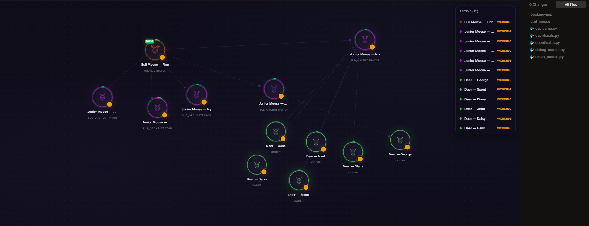

<p align="center">
  
</p>

<h1 align="center">Project Moose</h1>
<p align="center"><strong>Visual AI Agent Orchestration Platform</strong></p>
<p align="center">
  A canvas-based workspace where AI agents spawn, delegate, collaborate, and complete tasks — all in real-time.
</p>

<p align="center">
  
  
  
</p>

<p align="center">
  
</p>

---

## What is Project Moose?

Project Moose turns AI coding agents into a **visual, collaborative workforce**. Instead of chatting with a single AI assistant, you orchestrate a hierarchy of specialized agents on an interactive canvas — each with their own role, model, tools, and task list.

Think of it as a **visual IDE meets agent swarm**: you assign a task to a Bull Moose (orchestrator), it spawns Junior Moose agents to handle subtasks, which in turn spawn Deer (leaf workers) to do the actual coding, file editing, and research. You watch the entire operation unfold on a node-based canvas in real-time.

### Key Features

- **Canvas Workspace** — Drag-and-drop node graph where each agent is a visual node with live state indicators (idle, working, spawning, error, question)
- **Hierarchical Agent Spawning** — Orchestrator agents automatically decompose tasks and spawn child agents, forming a tree of delegation
- **Real-Time Todo Tracking** — Each agent displays a task badge on its canvas node; click to see a collapsible todo list with progress bars
- **Configurable Agent Definitions** — Define agent roles, system prompts, models, tools, spawn limits, and idle timeouts via JSON config
- **Multi-Model Support** — Each agent can use a different LLM (local via LM Studio, or cloud providers like OpenAI, Anthropic, Google)
- **Force-Directed Layout** — Nodes automatically repel each other to prevent overlap, with smooth redistribute-on-spawn
- **Liquid Spawn Animations** — New agents emerge with a morphing blob animation, colored glow rings, and ripple effects
- **Agent Communication** — Parent-child message passing for questions, scope requests, and answers
- **Context Usage Rings** — Visual ring around each node showing how much of the agent's context window is consumed
- **Task Completion Detection** — Agents glow green on task completion; todos auto-complete when leaf agents finish
- **GC Warning System** — Idle agents get countdown warnings before automatic cleanup

### The Agent Hierarchy

```
Bull Moose (Orchestrator)
├── Junior Moose (Sub-orchestrator)
│   ├── Deer (Leaf worker — writes code, edits files)
│   ├── Smart Moose (Research & analysis)
│   └── Debug Moose (Debugging specialist)
├── Scout Moose (Reconnaissance & exploration)
└── Trail Moose (Path planning & architecture)
```

Each level has different capabilities:
- **Orchestrators** can spawn children and manage todo lists
- **Leaf agents** execute tasks directly (file edits, code generation, research)
- All agents report progress back up the hierarchy

---

## Getting Started

### Prerequisites

- [Bun](https://bun.sh/) (v1.1+)
- An LLM provider (e.g., [LM Studio](https://lmstudio.ai/) for local models, or API keys for cloud providers)

### Installation

```bash
# Clone the repository
git clone https://github.com/prob32/projectmoose.git
cd projectmoose

# Install dependencies
bun install

# Start the dev server
bun run --cwd packages/opencode --conditions=browser src/index.ts web --port 4096
```

Then open `http://127.0.0.1:4096` in your browser.

### Configuration

Agent definitions are configured in `~/.config/opencode/moose-agents.json`:

```json
{
  "agents": {
    "bull_moose": {
      "name": "Bull Moose",
      "description": "Primary orchestrator that decomposes complex tasks",
      "color": "#8B5CF6",
      "role": "orchestrator",
      "model": {
        "providerID": "lmstudio",
        "modelID": "qwen/qwen3-coder-30b"
      },
      "spawnable": {
        "agents": ["junior_moose", "scout_moose", "trail_moose"],
        "limit": "auto"
      },
      "idle_timeout": 300
    }
  }
}
```

See the [moose-agents.json example](docs/moose-agents-example.json) for a complete configuration reference.

---

## Architecture

Project Moose is built as a layer on top of [OpenCode](https://opencode.ai), the open-source AI coding agent:

```
┌─────────────────────────────────────────────┐
│  Frontend (SolidJS)                         │
│  ├── Agent Canvas (nodes, connections, SVG) │
│  ├── Agent Chat Panel (per-agent messages)  │
│  ├── Todo Panel (collapsible task lists)    │
│  └── Sidebar (agent management)            │
├─────────────────────────────────────────────┤
│  Backend (Bun + Hono)                       │
│  ├── Moose Agent Definitions (JSON config)  │
│  ├── Agent Instances (SQLite persistence)   │
│  ├── Session Management (per-agent chats)   │
│  ├── Task Tool (spawn + delegate + todos)   │
│  └── SSE Events (real-time state sync)      │
├─────────────────────────────────────────────┤
│  OpenCode Core                              │
│  ├── LLM Provider Abstraction               │
│  ├── Tool System (file ops, bash, search)   │
│  ├── Session & Message Storage              │
│  └── Permission System                      │
└─────────────────────────────────────────────┘
```

### Tech Stack

| Layer | Technology |
|-------|-----------|
| Frontend | SolidJS, CSS (custom), Canvas SVG |
| Backend | Bun, Hono, SQLite (Drizzle ORM) |
| LLM Integration | OpenCode provider system (LM Studio, OpenAI, Anthropic, Google, etc.) |
| Real-time | Server-Sent Events (SSE) |
| State Management | SolidJS stores + reactive signals |

---

## Roadmap

- [x] Canvas workspace with agent nodes
- [x] Hierarchical agent spawning and delegation
- [x] Real-time todo tracking with canvas badges
- [x] Liquid spawn animations
- [x] Force-directed node layout
- [x] Agent communication (questions, scope requests)
- [x] Task completion detection and auto-complete
- [ ] Group Chat — lasso-select multiple agents into a shared conversation
- [ ] Agent templates and presets
- [ ] Canvas zoom and pan controls
- [ ] Export/import workspace configurations
- [ ] Mobile-friendly remote control interface

---

## Built On

Project Moose is built on [OpenCode](https://github.com/anomalyco/opencode) — the open-source AI coding agent. OpenCode provides the core LLM integration, tool system, session management, and permission framework that Moose extends with visual orchestration.

---

## License

MIT

---

<p align="center">
  <sub>Built with determination by moose, for moose.</sub>
</p>
